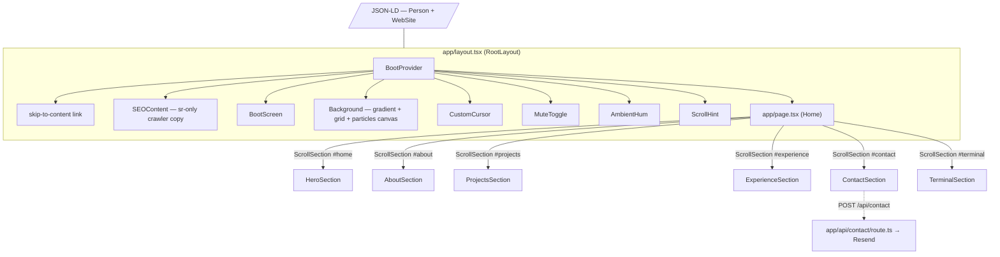
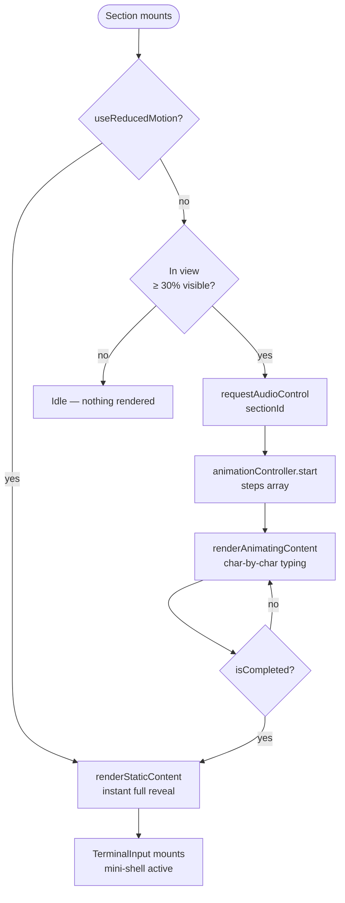
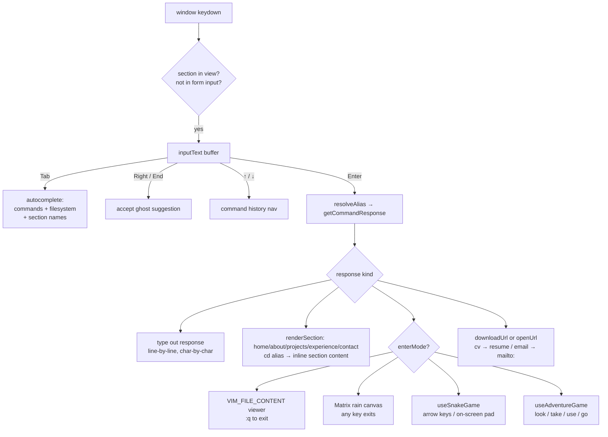
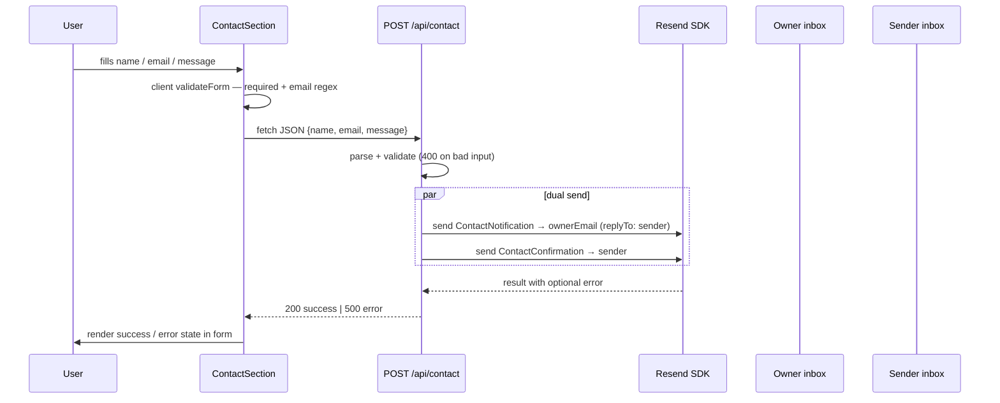
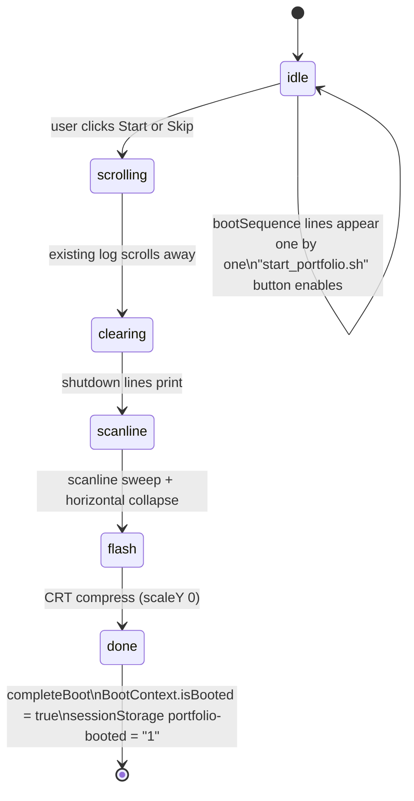
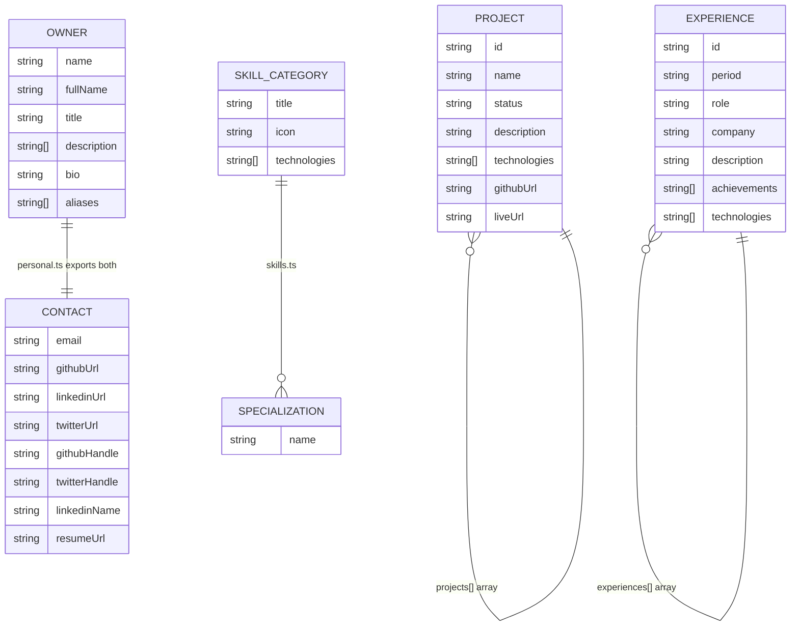
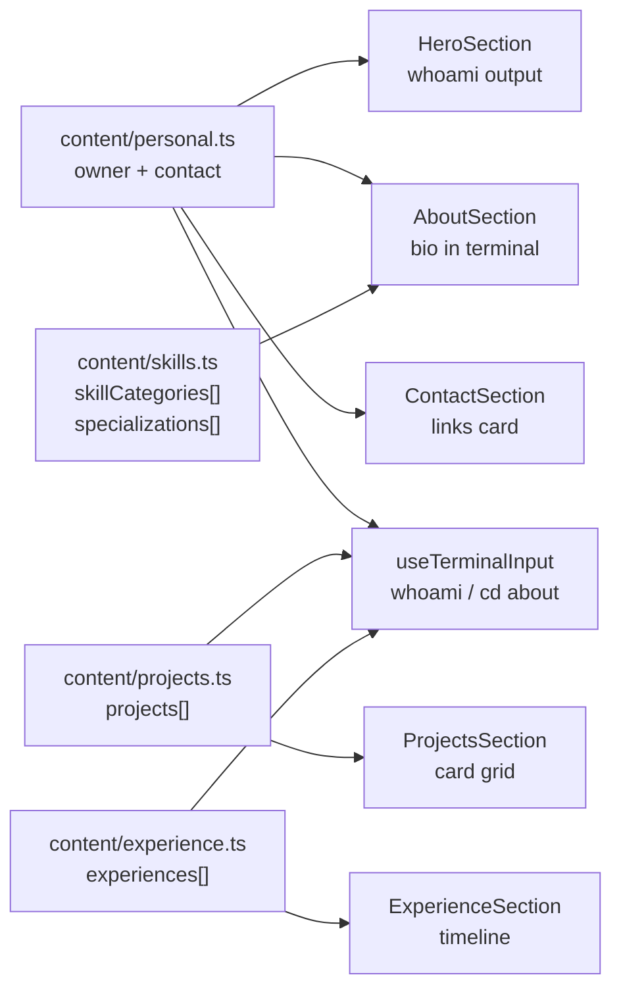

# my-portfolio

A terminal-themed personal portfolio for **Kudzai Prichard Matizirofa**, built as a Next.js 16 / React 19 single-page experience. Every section renders as a typed-out shell session — phosphor green on dark, animated, interactive, and audible.

The site doubles as a working pseudo-OS: it boots, snaps between sections, accepts shell commands, ships an inline `vim`, an ASCII Snake game, a text adventure, and a Matrix rain mode. None of that is decorative — the components, hooks, and animation engine were built to support it.

> The git history is the source of truth. This README explains structure and intent; for *why a specific change exists*, read the commit.

---

## Table of contents

1. [Tech stack](#tech-stack)
2. [Quick start](#quick-start)
3. [Environment variables](#environment-variables)
4. [Repository layout](#repository-layout)
5. [Architecture overview](#architecture-overview)
6. [Section anatomy](#section-anatomy)
7. [Hook dependency map](#hook-dependency-map)
8. [The animation pipeline](#the-animation-pipeline)
9. [Typing config reference](#typing-config-reference)
10. [Audio system](#audio-system)
11. [Interactive terminal](#interactive-terminal)
12. [Contact form & email pipeline](#contact-form--email-pipeline)
13. [Boot screen & scroll model](#boot-screen--scroll-model)
14. [Content data model](#content-data-model)
15. [Styling & theming](#styling--theming)
16. [Accessibility](#accessibility)
17. [SEO](#seo)
18. [Customising the content](#customising-the-content)
19. [Deployment](#deployment)
20. [Things to know before contributing](#things-to-know-before-contributing)

---

## Tech stack

| Layer            | Choice                                                                           |
|------------------|----------------------------------------------------------------------------------|
| Framework        | **Next.js 16** (App Router, `app/` directory)                                    |
| UI runtime       | **React 19** (client components for everything interactive)                      |
| Language         | **TypeScript 5** (strict mode, `@/*` path alias to repo root)                    |
| Styling          | Custom CSS (CSS custom properties) + per-component scoped `<style>` blocks. **Tailwind v4** + `@tailwindcss/postcss` are wired up but the codebase does not currently use Tailwind utility classes — the build pipeline is in place if you want to start. |
| Email            | **Resend** + `@react-email/components` for the contact pipeline                  |
| Lint             | `eslint-config-next` (core-web-vitals + typescript)                              |
| Node             | `20.x` (pinned in `package.json` `engines`)                                      |

There is **no test runner**, **no Storybook**, **no state-management library**, and **no UI kit**. Everything rendered on screen is hand-built from primitives in `src/`.

---

## Quick start

```bash
# Install
npm install

# Run dev server (http://localhost:3000)
npm run dev

# Production build
npm run build
npm run start

# Type-check without emitting
npx tsc --noEmit

# Lint
npm run lint
```

You will need a `.env.local` (see next section) for the contact form to actually deliver mail. Without it the form will return 500 — everything else (boot screen, terminal, animations) works fine.

---

## Environment variables

All public values use the `NEXT_PUBLIC_` prefix and are inlined at build time. `RESEND_API_KEY` is server-only and never reaches the client bundle.

| Variable                       | Used by                                  | Notes |
|--------------------------------|------------------------------------------|-------|
| `NEXT_PUBLIC_SITE_URL`         | `app/layout.tsx`, `sitemap.ts`, `robots.ts`, `StructuredData` | Canonical URL for OG/Twitter cards, sitemap, JSON-LD. Defaults to `http://localhost:3000`. **Set this in production** — every link that references itself derives from it. |
| `NEXT_PUBLIC_EMAIL`            | `app/api/contact/route.ts`, `src/content/personal.ts` | Owner email — recipient for contact-form notifications **and** the `replyTo` address, so replying in your mail client goes directly to the sender. |
| `NEXT_PUBLIC_GITHUB_URL`       | `personal.ts`, `StructuredData`          | Full URL e.g. `https://github.com/kudzaiprichard` |
| `NEXT_PUBLIC_LINKEDIN_URL`     | `personal.ts`, `StructuredData`          | |
| `NEXT_PUBLIC_TWITTER_URL`      | `personal.ts`, `StructuredData`          | |
| `NEXT_PUBLIC_GITHUB_HANDLE`    | `personal.ts` (display)                  | e.g. `@kudzaiprichard` |
| `NEXT_PUBLIC_TWITTER_HANDLE`   | `personal.ts`, `app/layout.tsx`          | Used as Twitter card `creator` and displayed on the Contact card. |
| `NEXT_PUBLIC_LINKEDIN_NAME`    | `personal.ts`                            | Display label for LinkedIn link. |
| `NEXT_PUBLIC_RESUME_URL`       | `personal.ts` (used by terminal `cv` cmd) | If unset, falls back to `/resume.pdf`. External URLs open in a new tab; same-origin paths trigger `download` attribute. |
| `RESEND_API_KEY`               | `app/api/contact/route.ts`               | **Server-only.** Without it the contact route 500s silently. |

A `.env.local` is used locally — strip the API key before pushing anywhere shared.

---

## Repository layout

```
my-portfolio/
├── app/                              # Next.js App Router root
│   ├── api/contact/route.ts          # POST handler — Resend dual-send
│   ├── globals.css                   # Theme tokens, snap-scroll, glitch keyframes (1 092 lines)
│   ├── layout.tsx                    # Root layout, metadata, BootProvider, ambient layers
│   ├── page.tsx                      # Snap-scroll page composition + arrow-key nav
│   ├── robots.ts                     # /robots.txt generator
│   └── sitemap.ts                    # /sitemap.xml generator
│
├── src/
│   ├── components/
│   │   ├── layout/                   # Cross-cutting layout chrome
│   │   │   ├── Background.tsx        # Particle canvas + grid + gradient
│   │   │   ├── BootScreen.tsx        # The boot sequence overlay (5 phases)
│   │   │   ├── CustomCursor.tsx      # Section-aware cursor (dot/ring/caret)
│   │   │   ├── ScrollHint.tsx        # Up/down scroll indicators
│   │   │   ├── context/BootContext.tsx
│   │   │   └── seo/
│   │   │       ├── SEOContent.tsx    # Visually-hidden semantic content for crawlers
│   │   │       └── StructuredData.tsx # JSON-LD Person + WebSite schemas
│   │   │
│   │   ├── sections/                 # The six full-viewport sections
│   │   │   ├── HeroSection.tsx
│   │   │   ├── AboutSection.tsx
│   │   │   ├── ProjectsSection.tsx
│   │   │   ├── ExperienceSection.tsx
│   │   │   ├── ContactSection.tsx
│   │   │   └── TerminalSection.tsx
│   │   │
│   │   └── shared/
│   │       ├── AmbientHum.tsx        # Looped 0.06-volume drone, fades in after boot
│   │       ├── MuteToggle.tsx        # Persists to localStorage, broadcasts via CustomEvent
│   │       ├── ScrollSection.tsx     # Wraps a section, syncs URL hash on intersect
│   │       ├── TerminalContainer.tsx # The 3-dot framed CRT box every section uses
│   │       ├── TerminalInput.tsx     # The active-line + history renderer
│   │       └── email-templates/
│   │           ├── ContactConfirmation.tsx  # Reply-to-sender template
│   │           └── ContactNotification.tsx  # Owner-notification template
│   │
│   ├── constants/
│   │   └── typingConfig.ts           # SINGLE source of truth for all typing feel
│   │
│   ├── content/                      # Site copy & data — edit these to make it yours
│   │   ├── personal.ts               # owner + contact (env-driven)
│   │   ├── projects.ts               # Project[] with its own Project interface
│   │   ├── experience.ts             # Experience[] with its own Experience interface
│   │   ├── skills.ts                 # SkillCategory[] + specializations[]
│   │   └── index.ts                  # Re-exports
│   │
│   ├── hooks/                        # All client-side logic lives here
│   │   ├── useAnimationController.ts # React wrapper around lib/animationController
│   │   ├── useTypingAnimation.ts     # Step-generator for human-like typing
│   │   ├── useKeystrokeAudio.ts      # Audio pool + keystroke playback per section
│   │   ├── useInView.ts              # IntersectionObserver wrapper
│   │   ├── useReducedMotion.ts       # prefers-reduced-motion media query
│   │   ├── useTerminalInput.ts       # The interactive shell — ~2 600 lines, the core
│   │   ├── useSnakeGame.ts           # Snake game state machine
│   │   └── useAdventureGame.ts       # Text adventure world + parser
│   │
│   ├── lib/                          # Framework-agnostic utilities
│   │   ├── animationController.ts    # Imperative step-runner with cancellation
│   │   ├── animationTypes.ts         # All animation/audio interfaces
│   │   ├── audioController.ts        # Global "which section owns the audio" arbiter
│   │   ├── glitch.ts                 # Per-character glitch overlay system
│   │   ├── particles.ts              # Particle physics, zones, clusters, hubs
│   │   └── utils.ts                  # delay, debounce, throttle
│   │
│   └── types/
│       └── index.ts                  # Shared component prop types
│
├── public/
│   ├── sounds/                       # ambient_hum.wav + keystroke_{1..4}.mp3
│   └── favicon.* / og-image.png / site.webmanifest / web-app-manifest-*.png
│
├── eslint.config.mjs
├── next.config.ts                    # Empty config — all defaults
├── postcss.config.mjs                # Loads @tailwindcss/postcss
├── tsconfig.json                     # @/* → ./*
└── package.json
```

---

## Architecture overview

The site is a single page composed of six full-viewport snap-scrolled sections. A shared layout owns the persistent visual chrome (boot screen, particles, cursor, audio toggle, scroll hint) and a `BootProvider` context gates anything that should not run before the user dismisses the boot screen.



---

## Section anatomy

Every section (except `Terminal`) follows the same two-render-mode pattern:



**What happens at each stage:**

1. **`sr-only` block** — always in the DOM, carries the real semantic content for screen readers and crawlers. The visible animated tree is `aria-hidden="true"` during animation.
2. **`TerminalContainer`** — the 3-dot CRT frame. Renders either the *animating* tree (char-by-char) or the *static* tree (instant full reveal).
3. **Animating render** — types out one or more shell-style commands, then reveals their output (real content from `src/content/`).
4. **Static render** — shown immediately under `prefers-reduced-motion`, or once animation completes.
5. **`TerminalInput`** — mounts after animation completes; provides the per-section mini-shell.

The full lifecycle in terms of hook orchestration:

```mermaid
sequenceDiagram
    participant V as Viewport
    participant H as useInView
    participant A as useKeystrokeAudio
    participant C as useAnimationController
    participant T as useTypingAnimation
    participant S as Section state

    V->>H: IntersectionObserver fires (≥30% visible)
    H->>A: requestAudioControl(sectionId)
    A->>A: audioController.setActiveSection — others release
    A-->>H: hasAudioControl = true
    H->>C: start(steps)
    loop For each AnimationStep
        C->>T: emit a keystroke (delay-aware)
        T->>S: setText(prev + char)
        T->>A: onTypingKeystroke(char) → playKeystroke
    end
    C->>S: onComplete → flip to static render
    Note over S: TerminalInput mounts; mini-shell active
```

The `audioController` ensures only one section at a time owns the keystroke channel, so scrolling between sections does not produce overlapping click loops.

---

## Hook dependency map

Which hooks each part of the site uses:

| Consumer | useInView | useAnimationController | useTypingAnimation | useReducedMotion | useKeystrokeAudio | useTerminalInput | useSnakeGame | useAdventureGame |
|---|:---:|:---:|:---:|:---:|:---:|:---:|:---:|:---:|
| HeroSection | ✓ | ✓ | ✓ | ✓ | ✓ | ✓ (mini) | | |
| AboutSection | ✓ | ✓ | ✓ | ✓ | ✓ | ✓ (mini) | | |
| ProjectsSection | ✓ | ✓ | ✓ | ✓ | ✓ | ✓ (mini) | | |
| ExperienceSection | ✓ | ✓ | ✓ | ✓ | ✓ | ✓ (mini) | | |
| ContactSection | ✓ | ✓ | ✓ | ✓ | ✓ | | | |
| TerminalSection | ✓ | ✓ | ✓ | ✓ | ✓ | ✓ (full) | ✓ | ✓ |
| CustomCursor | | | | ✓ | | | | |
| Background | | | | ✓ | | | | |

"mini" = reduced command set keyed to the section; "full" = the complete interactive shell.

---

## The animation pipeline

Three layers, separated for testability and cancellation safety:

```mermaid
flowchart LR
    Config["constants/typingConfig.ts\nbaseSpeed, multipliers,\nsequence timings"]
    -->|getBaseSpeedForSection\ngetPatternForSection| Hook

    Hook["useTypingAnimation\ngenerateSteps()"]
    -->|AnimationStep[]| Controller

    Controller["lib/animationController\nstate machine + timers"]
    --> Section[Section state setters]

    Hook --> Audio["onKeystroke\n→ useKeystrokeAudio"]

    subgraph States
        idle --> running --> completed
        running --> cancelled
        running --> paused --> running
    end
```

- **`constants/typingConfig.ts`** is the *only* place to change typing feel. It is the single source of truth for base speeds, pattern multipliers, audio ramp settings, and sequence timings. See [Typing config reference](#typing-config-reference) below.
- **`lib/animationController.ts`** is a class-based imperative runner. It tracks state (`idle | running | paused | completed | cancelled`), holds `AnimationStep[]` (each step is `{ action: () => void, duration: number }`), and is responsible for **clean cancellation** — every timer it schedules is recorded and cleared on `cancel()`. Sections call `animation.cancel()` on unmount and on `inView = false`, so navigating away never leaves orphaned `setTimeout` chains.
- **`useTypingAnimation`** turns a target string into an `AnimationStep[]` honouring the section's pattern: positional speed (slow at start, fast through middle, slight slowdown at end), character-class multipliers, repeat-character reduction (muscle memory), random micro-pauses, and ±30% natural jitter.

### Reduced-motion path

Every section checks `useReducedMotion()` and, when set, **skips animation entirely** — flipping straight to the static render and calling `animation.complete()` immediately. Glitch overlays, the particle field loop, and cursor pulse also short-circuit under this flag.

---

## Typing config reference

All values live in `src/constants/typingConfig.ts` and are the exact numbers in the codebase:

### Per-section base speeds

| Section | `baseSpeed` | Character-feel notes |
|---------|------------|----------------------|
| `hero` | **90 ms/char** | Most dramatic: `startSpeedMultiplier 2.2`, 10% random-pause probability, extension slowdown ×4.0 |
| `about` | **65 ms/char** | Flows faster in the middle (`middleSpeedMultiplier 0.65`), fewer hesitations (6% pause prob) |
| `projects` | **70 ms/char** | Extension slowdown ×3.0 |
| `experience` | **70 ms/char** | Slightly quicker start (`startSpeedMultiplier 1.6`) |
| `contact` | **70 ms/char** | Global defaults, no overrides |
| `terminal` | **25 ms/char** | Near-instant: uniform multipliers (1.0/0.9/1.0), 3% pause probability |

### Global pattern (applied to every section before overrides merge)

| Parameter | Value | Effect |
|-----------|-------|--------|
| `startSpeedMultiplier` | 1.8× | Slower at the start — thinking before typing |
| `middleSpeedMultiplier` | 0.7× | Fastest in the flow |
| `endSpeedMultiplier` | 1.3× | Slight brake near end |
| `extensionSpeedMultiplier` | 3.5× | Pause on `.txt`, `.sh`, etc. |
| `randomPauseProbability` | 8% | Chance of micro-hesitation per keystroke |
| `randomPauseMultiplier` | 2.5× | How long each hesitation lasts |
| `repeatedCharMultiplier` | 0.8× | Faster on consecutive identical chars (muscle memory) |
| Slow characters | `. / \ - _ ~ \|` | +1.5× duration each |

### Character-class multipliers

| Class | Multiplier | Rationale |
|-------|-----------|-----------|
| Space | 0.72× | Thumb — fastest key |
| Lowercase | 1.0× | Baseline |
| Uppercase | 1.25× | Holding Shift |
| Digit | 1.35× | Reaching for number row |
| Path separator (`-_/\|~.;`) | 1.45× | Deliberate terminal keystrokes |
| Special symbol (`@#$%^&*…`) | 1.55× | Shift + number row |

### Sequence timing defaults

| Timing | Value |
|--------|-------|
| Initial delay before first command | 500 ms |
| Post-command delay (before output appears) | 350 ms |
| Between-commands delay (output → next command) | 900 ms |

### Audio config (also in `typingConfig.ts`)

| Setting | Value |
|---------|-------|
| `baseVolume` | 0.4 |
| `volumeRampEnabled` | true |
| `volumeRampKeystrokes` | 10 (ramp from 50% → 100% of baseVolume) |
| `volumeDecayDelayMs` | 2 000 ms of silence triggers decay |
| `volumeDecayFactor` | 0.5 (halves the ramp progress) |

---

## Audio system

```mermaid
flowchart TD
    Section1[HeroSection] -- requestAudioControl hero --> Ctrl[audioController\nactiveSection: string?]
    Section2[AboutSection] -- requestAudioControl about --> Ctrl
    Section3[TerminalSection] -- requestAudioControl terminal --> Ctrl

    Ctrl -- only one section owns it --> Pool[AudioPool\n3 elements per file × 4 keystroke files]
    Pool --> KS["keystroke_1..4.mp3\npublic/sounds/"]

    Mute[MuteToggle button] -- localStorage: keystroke-audio-muted --> Hook[useKeystrokeAudio]
    Mute -- CustomEvent: audio-mute-change --> Hook
    Hook --> Pool

    AmbientHum[AmbientHum] -.fades to 0.06 volume.- HumFile["ambient_hum.wav\npublic/sounds/"]
    BootCtx[BootProvider isBooted] --> AmbientHum
```

Notes worth knowing before changing anything in `useKeystrokeAudio.ts`:

- **Object pool** — three `Audio` element instances per source file are created up front and rotated, because reusing a single element on rapid keystrokes (every 25–90 ms) drops sounds in Safari/iOS.
- **Volume ramp** — `audioConfig.volumeRampEnabled` makes the first 10 keystrokes after a `resetVolumeRamp()` call ramp from 50% to 100% of base volume. This eliminates the "machine gun" feel when a long string begins. Each section calls `resetVolumeRamp()` at the start of every command in its sequence.
- **Decay after inactivity** — after 2 s of silence the next keystroke partially decays the ramp (`volumeDecayFactor: 0.5`) so a fresh burst again starts softer.
- **Hand alternation** — characters are mapped to left/right/thumb keyboard regions; each region picks a different keystroke sample, with a "no-immediate-repeat" guard. Space gets its own sample.
- **Mute persistence** — `localStorage` key `keystroke-audio-muted`. Because `localStorage` storage events do not fire in the same tab, `MuteToggle` also dispatches a `CustomEvent('audio-mute-change')` for in-tab listeners.
- **`AmbientHum`** loops `/sounds/ambient_hum.wav` at volume 0.06. It starts only after `BootProvider.isBooted === true` and respects the same mute key.

---

## Interactive terminal

`useTerminalInput.ts` (~2 600 lines) is the largest single file in the codebase and the heart of the experience. It is consumed by every section's `TerminalInput`, but only **`TerminalSection` (`#terminal`)** exposes the full command set.



### Full command reference

Commands are registered in `getCommandResponse()` and surfaced via `help`.

| Category | Commands |
|----------|----------|
| **Navigation** | `cd home\|about\|projects\|experience\|contact` — renders section content inline |
| **Filesystem** | `ls`, `ls -l`, `ls -la`, `pwd`, `cat <file>`, `cd <dir>` |
| **System** | `whoami`, `neofetch`, `htop`, `kill <proc>`, `date`, `history`, `man <topic>`, `echo <text>` |
| **Network** | `ping <host>`, `ssh <host>`, `curl <args>`, `sudo <cmd>` |
| **Git** | `git log`, `git blame` (aliases: `hist`, `annotate`) |
| **Reach-out** | `cv` (downloads resume), `email` (opens `mailto:` with pre-filled subject) |
| **Games** | `snake`, `adventure` |
| **Fun** | `vim` / `vi` / `nano`, `ascii`, `matrix`, `hack`, `sl` |
| **Utility** | `help` / `?` / `commands`, `clear`, `exit`, `settings` |

### Aliases and did-you-mean

`COMMAND_ALIASES` maps Windows/Mac names to canonical commands — `dir`, `type`, `notepad`, `runas`, `nvim`, `code`, `wget`, `screenfetch`, etc., all resolve. Unknown commands run through `findClosestCommand` for a `Did you mean: ?` suggestion before returning `bash: <cmd>: command not found`.

### Loading messages

Commands that feel "heavyweight" (`neofetch`, `htop`, `git log`, `ssh`, `sudo`, `curl`) show a sequence of fake loading lines before their real output, defined in `LOADING_SETS`. This is the right place to add fake telemetry for a new command.

### In-memory filesystem

The terminal maintains a fake `~` directory tree containing project READMEs at `~/projects/<slug>/README.md`, an `experience.log`, fake config files, and a `~/.secret/` directory rewarded by `ls -la`. These are hand-authored in `useTerminalInput.ts` and currently mirror but do not automatically track changes in `src/content/projects.ts` — if you add or rename a project, update the filesystem tree manually.

### Inline mini-shell on non-terminal sections

Hero, About, Projects, and Experience sections mount a `TerminalInput` after animation completes, with a **reduced** command set (navigation, `whoami`, `help`, `clear`). They share the same `useTerminalInput` hook keyed by `sectionId`, and `getCommandResponse` switches on it.

---

## Contact form & email pipeline



- Both emails use `@react-email/components` templates (`src/components/shared/email-templates/`). They share a CRT-window aesthetic matching the site.
- The notification sets `replyTo` to the sender's email, so the owner can reply directly from their mail client.
- The `from` address is `noreply@prichard.co.zw` in `app/api/contact/route.ts`. **Change this if you fork** — Resend requires a verified sending domain.
- The route does **not** persist messages anywhere. To keep a record, add a write to your store before or after the `Resend` calls.
- Client-side validation: required fields + `/^[^\s@]+@[^\s@]+\.[^\s@]+$/` for email. Field-level errors clear on edit.

### Easter egg

After Contact finishes animating, a `root@kudzai:~# press Enter to enter superuser mode` line appears. Pressing **Enter** while no form field is focused scrolls to `#terminal`. Modifier keys are ignored; any active `INPUT`/`TEXTAREA`/`BUTTON`/`SELECT`/`contentEditable` short-circuits the handler.

---

## Boot screen & scroll model

`BootScreen` overlays a 5-phase CRT-style boot when the page first loads:



- `sessionStorage['portfolio-booted']` skips the screen on subsequent navigations within the same tab, so internal hash-link navigation does not replay the sequence.
- A **Skip** button appears 1.5 s in for impatient users.
- `prefers-reduced-motion` collapses every phase animation to 0.01 ms.

### Scroll model

`html` has `overflow: hidden`; `body` has `overflow-y: scroll; scroll-snap-type: y mandatory`. Every `<section>` is a `100vh` snap target with `scroll-snap-stop: always`. `ScrollSection` updates `window.location.hash` via `replaceState` when its section is ≥50% visible, and reads the hash on mount to restore the right section from a deep link.

`app/page.tsx` adds **arrow-key navigation** (`Up`/`Left` and `Down`/`Right`) that pages between sections and moves DOM focus. It is gated on `isBooted` and respects `e.defaultPrevented` so per-section handlers (the terminal's own arrow handling, the Contact Enter easter egg) win.

---

## Content data model

### The two interface systems — and why they differ

There are two parallel sets of interfaces in this codebase:

- **`src/types/index.ts`** — general-purpose component prop types. `Project` here has fields like `title`, `demoUrl`, `featured`, `imageUrl`, `status: 'completed' | 'in-progress' | 'archived'`.
- **`src/content/*.ts`** — the interfaces actually consumed by section components. Each content file re-declares a simpler, purpose-built interface.

The section components and `useTerminalInput` import exclusively from `src/content/`. `src/types/index.ts` is used for component props (`ScrollSectionProps`, `TerminalContainerProps`, `ButtonProps`, etc.). If you need to add a field to a project card, edit the interface in `src/content/projects.ts` and the data in `projects[]` — not `types/index.ts`.

### Actual content shapes (what sections render)



`status` on `Project` is the display badge: `'LIVE' | 'BETA' | 'WIP'`. `period` on `Experience` is a freeform string (`'2023 - Present'`).

### How content flows to the UI



Note: the terminal's **in-memory filesystem** (`~/projects/<slug>/README.md`) does *not* auto-sync with `content/projects.ts` — those README files are hand-authored inside `useTerminalInput.ts`.

---

## Styling & theming

All theme values live as CSS custom properties in `app/globals.css`. There are five families:

| Family             | Examples                                              |
|--------------------|-------------------------------------------------------|
| Colours            | `--color-primary`, `--color-bg-dark`, dim/dimmer/dimmest opacity tiers |
| Spacing            | `--spacing-xs` … `--spacing-2xl` (mobile-first, 6 breakpoint overrides) |
| Typography         | `--font-mono`, `--font-size-xs` … `--font-size-3xl`, `--line-height-*` |
| Layout             | `--container-max-width`, `--terminal-padding-*`, `--grid-size`, `--grid-opacity` |
| Z-index            | `--z-background` (0) … `--z-cursor` (100 000)          |

### Per-section phosphor tints

Each section shifts the green hue via a `section[id="..."]` selector that overrides `--color-primary` and its dim variants. Hue-only shift keeps contrast against `#0a0f0a` constant (S=100% / L≈50%):

| Section     | Tint        |
|-------------|-------------|
| `home`      | `#00ff41` (anchor) |
| `about`     | `#22ff52`   |
| `projects`  | `#00ff7d`   |
| `experience`| `#3aff2a`   |
| `contact`   | `#00ff41` (anchor — action point) |
| `terminal`  | `#00ff70`   |

Background, particles, grid, gradient, and cursor stay at the anchor `#00ff41` — they form the constant ambient layer that prevents the per-section shift from feeling like five different sites.

### Component-scoped styles

Every section component has a `<style>{...}</style>` block at the bottom for its own classnames (`.hero-section-name`, `.about-section-skill-category`, etc.). Convention:

- Use CSS variables from `globals.css` for anything that should track the theme.
- Hard-code anchor green (`rgba(0, 255, 65, …)`) for *fills* and *backgrounds* you want constant across sections (skill-card washes, tech-badge fills) — this is intentional and keeps variation cohesive.

### Glitch effects

`src/lib/glitch.ts` provides `startCharacterGlitch` — a per-character overlay that rotates through random chars at configurable cadence and intensity. Active on:

- Hero name + four highlight phrases in About.
- Project names in Projects.
- Role names in Experience.
- The `visitor@kudzai` part of the terminal title bar.
- Random output lines after `cd <section>` in the Terminal.

All glitch effects no-op under `prefers-reduced-motion`.

### Custom cursor

Hidden on touch devices (`@media (hover: none) and (pointer: coarse)` — `cursor: none !important` on `*`, replaced by a `<div class="custom-cursor">` containing a dot (8 px), ring (36 px border), and caret (2 px). JS sets `data-state="default|link|input"` and `data-section="home|about|…"` based on `event.target.closest()` and IntersectionObserver. Per-section glow multipliers (hero 1.2×, terminal 1.3×, about 0.8×) are derived from typing-config pacing — faster sections get brighter glows.

### Particle background

`Background.tsx` runs `lib/particles.ts` on a `<canvas>` at z-index 2. Particles maintain *zones* (3×3 grid to prevent drift) and *cluster zones* (focal points of higher density).

| Setting              | Desktop | Mobile |
|----------------------|---------|--------|
| `numberOfParticles`  | 200     | 70     |
| `connectionDistance` | 180 px  | 120 px |
| `hubConnectionDistance` | 210 px | 150 px |
| Target FPS           | 60      | 30     |

Mobile detection: `width < 768 || ontouchstart || maxTouchPoints > 0`. `prefers-reduced-motion` renders **one** static frame and stops the RAF loop entirely.

---

## Accessibility

This site goes hard on the visual aesthetic, which makes accessibility especially important. What is in place:

- **Skip link** (`a.skip-to-content`) at the top of `<body>`, visible on focus, jumps to `#home`.
- **`SEOContent`** in `app/layout.tsx` is a visually-hidden but DOM-present block with the full semantic content (heading hierarchy, projects, experience, contact). Crawlers and assistive tech that do not execute the animation pipeline still get everything.
- Every animated section renders a parallel `<div class="sr-only" aria-live="polite">` with the same content as plain HTML, and marks the visible animated tree as `aria-hidden="true"` while it is typing.
- **`prefers-reduced-motion: reduce`** is honoured in: every section's animation (skipped → static), particle field (single static frame), boot screen (collapsed durations), glitch effects (no-op), and a `globals.css` rule that compresses every `*` animation/transition to 0.01 ms.
- **Focus management** — arrow-key section navigation calls `targetSection.focus({ preventScroll: true })` so the next section becomes a tab anchor. Sections have `tabIndex={-1}` and `outline: none` so the focus is programmatic rather than visible.
- **Focus indicators** — `:focus-visible` gets a 2 px green outline + glow site-wide.
- **Touch targets** — `--min-touch-target: 44 px` (48 px on coarse pointers), enforced on CTAs, contact links, social icons, and the Snake on-screen d-pad.
- **Form errors** — per-field error messages with `[ERROR]` prefix, distinct red border, and animated entry — rendered inline below each field.
- **`role="log"`** on `TerminalContainer` with an `aria-label`.

What is *not* fully accessible: the interactive terminal lacks a validated power-user screen-reader workflow. The `sr-only` summary in `TerminalSection` lists available commands, but this has not been tested with a real blind-user workflow.

---

## SEO

Three layers of crawler signal:

1. **`metadata`** in `app/layout.tsx` — title, description, keywords, authors, canonical, OG image, Twitter card, robots directives.
2. **`StructuredData`** (`<script type="application/ld+json">`) — `Person` and `WebSite` schema, with `alternateName` for name spelling variants and `knowsAbout` enumerating tech stack.
3. **`SEOContent`** — the visually-hidden DOM block with full semantic heading hierarchy, projects, experience, and contact. Crawlers that do not execute JS animations still index the real content.

Plus `app/sitemap.ts` (one entry, monthly changeFrequency, priority 1.0) and `app/robots.ts` (allow all, disallow `/api/` and `/_next/`).

---

## Customising the content

If you fork this for yourself, **everything you need to change lives in `src/content/` and `.env.local`**:

| File | Edit to change |
|------|---------------|
| `src/content/personal.ts` | Name, title, bio, three-line description, aliases. Contact links read from env. |
| `src/content/projects.ts` | Project cards. Each `Project` has `id`, `name`, `status` (`LIVE`/`BETA`/`WIP`), `description`, `technologies[]`, `githubUrl`, optional `liveUrl`. **Current values are placeholders (`github.com/yourusername/...`) — replace them.** |
| `src/content/experience.ts` | Work history. `Experience[]` with `period`, `role`, `company` (prefix with `@ `), `description`, `achievements[]`, `technologies[]`. **Also placeholders — replace them.** |
| `src/content/skills.ts` | `skillCategories[]` (4 cards: AI/ML, Backend, Frontend, DevOps) + `specializations[]` (6 chip tags). |
| `.env.local` | All contact links, email, resume URL, site URL. |

The terminal's `formatSectionLines` in `useTerminalInput.ts` reads from these same content files — a change in `src/content/projects.ts` automatically updates both the Projects card grid **and** the output of `cd projects` in the terminal.

Two places you also need to update manually when changing projects:
1. The in-memory filesystem tree in `useTerminalInput.ts` (project READMEs under `~/projects/<slug>/README.md`) — hand-authored, does not auto-sync.
2. The `AboutSection.tsx` bio JSX block — it uses a richer JSX tree with four glitching highlight phrases hardcoded in the component. The `bio` field in `personal.ts` is used by the *terminal's* `whoami` and `cd about` output, not by the visual About card.

Static assets (`/og-image.png`, `/resume.pdf`, favicons) live in `public/`.

---

## Deployment

- **Configured for Vercel** (the most recent migration removed `netlify.toml`; there is no `vercel.json` because the defaults work for a Next.js App Router project).
- Node 20.x is pinned in `package.json` `engines`.
- All env vars in [Environment variables](#environment-variables) must be set in the Vercel dashboard. `RESEND_API_KEY` is the only server-only one.
- **Set `NEXT_PUBLIC_SITE_URL`** to the canonical domain — every OG image URL, sitemap entry, JSON-LD `url`, and Resend `replyTo` derives from it.
- The `from` address `noreply@prichard.co.zw` in `app/api/contact/route.ts` requires a verified domain in your Resend account. Change it if you're not running this site under that domain.

---

## Things to know before contributing

These are non-obvious, learned-the-hard-way things — read them before touching the listed files.

### Animation cancellation is load-bearing

`useAnimationController.cancel()` is called from every section's unmount cleanup *and* from the `onInViewChange(false)` handler when the section scrolls out before completing. Without it, you get stuck partial states — half-typed strings that never reveal their output, leaked `setTimeout` chains, and audio that keeps firing after navigation. If you add a new section, mirror the pattern in `HeroSection.tsx` (look for the `eslint-disable-next-line react-hooks/exhaustive-deps` comments — they document why the unmount-only effect is intentionally dep-free).

### `audioController` is a singleton

There is exactly one global "active section" at a time. New sections must call `requestAudioControl(sectionId)` on enter and `releaseAudioControl()` on exit — otherwise their `onTypingKeystroke` callback will silently no-op (`hasAudioControl === false`) or steal audio from a section that should own it.

### Don't put typing speeds in components

All typing feel — base speed, pattern multipliers, sequence delays, audio ramp settings — lives in `src/constants/typingConfig.ts`. Tune one section by editing its entry in `sectionTypingConfigs`, not by sprinkling magic numbers in the component. The helpers `getBaseSpeedForSection` and `getPatternForSection` are the only intended consumers.

### The two `Project` / `Experience` interfaces

`src/types/index.ts` and the individual content files each define their own `Project` and `Experience` interfaces with **different shapes**. The section components import from `src/content/` — that is the authoritative shape for what gets rendered. `src/types/index.ts` is for component prop types. Do not confuse them when adding fields.

### `<style>{...}</style>` blocks at the bottom of section components

Intentional — each section's component-specific CSS lives in a `<style>` element inside its return. Do not move them to `globals.css`; the locality is what makes large refactors safe. When writing a new section, scope all classnames with the section prefix (`.hero-section-…`, `.about-section-…`).

### The interactive terminal is one large file by design

`useTerminalInput.ts` is ~2 600 lines because it contains the entire shell — command table, alias map, in-memory filesystem, response generators, parser, history, autocomplete, and mode dispatch. It has been kept in one file so all the pieces stay co-located. If you add a command: add a response generator in the "RESPONSES" region, a branch in `getCommandResponse`, and an entry in `generateHelp`.

### Reduced motion is non-negotiable

Every animated effect needs a `prefers-reduced-motion` short-circuit. The pattern is `const prefersReducedMotion = useReducedMotion()` then early-return or skip-to-static. There is no CI enforcement — the only protection is the convention.

### Tailwind v4 is plumbed but unused

`@tailwindcss/postcss` is configured and `tailwindcss` is a devDependency. There are no utility classes in the codebase. Either start using Tailwind for new components, or remove the dependency — the current state costs ~1.4 MB of devDependencies for nothing.

---

## License

No license file is currently present in this repository. Treat the source as **all rights reserved** unless and until one is added.
